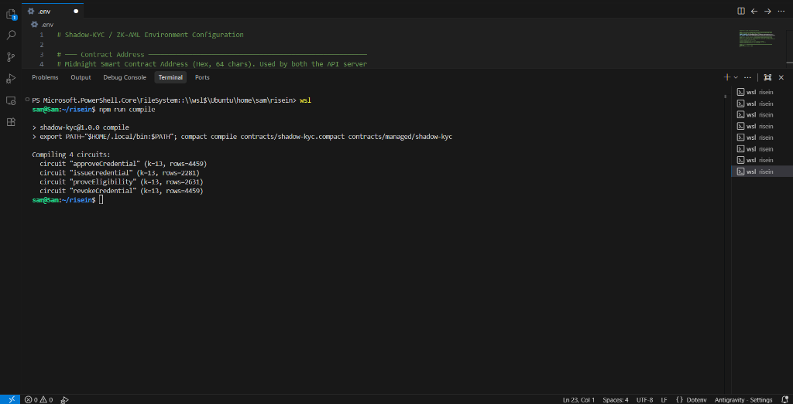
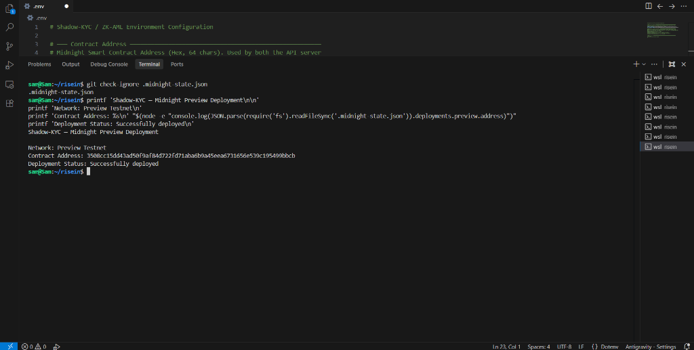

# 🛡️ Shadow-KYC

> Privacy-preserving KYC/AML verification using Zero-Knowledge Proofs (ZKPs) on the Midnight Preview Testnet.

Shadow-KYC is a decentralized KYC/AML system built on the **Midnight Network** using **Compact Smart Contracts**, **React**, **TypeScript**, and the **Midnight.js SDK**. Users can request identity verification and prove regulatory eligibility **without ever revealing their personal information** — the secret stays private, only its cryptographic commitment goes on-chain.

---

## 🎯 What This Does

Shadow-KYC is a privacy-preserving KYC/AML verification system built on Midnight. Users can request and prove ownership of an approved KYC credential without revealing their underlying secret or identity on-chain. The blockchain stores cryptographic credential commitments and public verification state while sensitive identity information remains private.

---

## ✨ Features

- 🔒 Privacy-preserving identity verification using Zero-Knowledge Proofs (ZKPs)
- 📄 Request KYC/AML credentials (user action, ZK proof generated)
- ✅ Authority approval workflow (on-chain Compact circuit)
- ❌ Credential revocation by authority
- 📜 On-chain credential registry (Midnight Preview Testnet)
- 📊 Audit history
- 🌐 React + TypeScript + Vite frontend with persistent wallet connection
- ⚡ Node.js REST API backend
- 🧪 14/14 smart contract tests passing

---

## 💡 Initial Product Idea

Shadow-KYC aims to provide privacy-preserving KYC/AML verification for applications that need regulatory compliance without requiring users to repeatedly expose sensitive identity information. A user receives a cryptographic credential commitment after verification and can later prove eligibility using a zero-knowledge proof, allowing applications to verify compliance while minimizing exposure of personal data.

---

## 📜 Contract Address

| Network | Contract Address |
|---------|-----------------|
| Preview | `3508cc15dd43ad50f9af84d722fd71aba6b9a45eea6731656e539c195499bbcb` |
| Preprod | Not deployed |

---

## 🏗️ Architecture

```text
  React Frontend (Vite)
        │
        ▼
  REST API Server (Node.js)
        │
        ├─── Midnight JS SDK ──▶ Midnight Preview Network (RPC / Indexer)
        │                              │
        │                        Compact Smart Contract
        │                        (shadow-kyc.compact)
        │
        └─── ZK Proof Server (Docker) — generates ZK proofs locally
```

---

## 🔐 Privacy Model

The Compact smart contract separates what is public on-chain from what remains private as a zero-knowledge witness.

### Public — visible on-chain

| Field | Type | Description |
|---|---|---|
| `authority` | `Bytes<32>` | Authority dapp-specific public key (deliberately disclosed) |
| `authorityName` | `Opaque<string>` | Authority public name (deliberately disclosed) |
| `pendingCredentials` | `Set<Bytes<32>>` | Credential commitments awaiting approval |
| `credentials` | `Set<Bytes<32>>` | Approved credential commitments |
| `revokedCredentials` | `Set<Bytes<32>>` | Revoked credential commitments |
| `eligibilityCount` | `Uint<64>` | Public counter of eligibility proofs performed |

### Private — not revealed in on-chain state

| Element | Description |
|---|---|
| `localSecret()` witness | The caller's 32-byte secret used privately during proof generation; it is not stored in or revealed by the on-chain contract state |
| User identity | The underlying identity information represented by the secret |

The credential commitment is computed inside the circuit using Midnight's built-in `persistentHash`.

### What the user proves without revealing

The `proveEligibility()` circuit proves that the user knows the secret corresponding to an approved credential commitment without revealing the secret itself.

---

## 🛠️ Tech Stack

| Layer | Technology |
|--------|------------|
| Smart Contract | Compact (Midnight DSL) |
| Blockchain | Midnight Preview Testnet |
| Frontend | React + TypeScript + Vite |
| Backend | Node.js + REST API |
| Wallet | 1AM Wallet (Chrome Extension) |
| ZK Proofs | Midnight Proof Server (Docker) |
| Testing | Vitest |

---

## 🚀 Getting Started

### Prerequisites

- Node.js >= 22
- Docker Desktop (with WSL2 integration enabled)
- 1AM Wallet browser extension (set to **Preview Testnet**)
- Compact compiler (from [Midnight Developer Hub](https://midnight.network))

### Install

```bash
git clone https://github.com/Samruddhi2805/shadow-kyc.git
cd shadow-kyc
npm install
```

### Start Infrastructure (Docker)

```bash
npm run proof-server:start
```

This starts three containers:
- `risein-proof-server` — local ZK proof generation (port 6300)
- `risein-node` — Midnight relay node
- `risein-indexer` — contract state indexer (port 8088)

### Compile the Smart Contract

```bash
npm run compile
```

Expected output:
```
Compiling 4 circuits:
circuit "approveCredential" (k=13, rows=4459)
circuit "issueCredential"   (k=13, rows=2281)
circuit "proveEligibility"  (k=13, rows=2631)
circuit "revokeCredential"  (k=13, rows=4459)
```

### Start the API Server

```bash
npm run api
```

> If port 8080 is already in use, free it first: `lsof -ti :8080 | xargs kill -9`
> Or use the convenience script: `npm run api:fresh`

### Start the Frontend

```bash
npm run frontend:dev
```

Then open http://localhost:5173 (or http://localhost:8080 for the API-served static build).

### Deploy to Preview Testnet

```bash
npm run deploy -- --network preview
```

---

## ✅ Running Tests

```bash
npm test
```

Expected output:

```
✓ tests/shadow-kyc.test.ts (14 tests) ~330ms
Test Files  1 passed (1)
    Tests  14 passed (14)
```

Test coverage includes:

- Constructor: authority name set, credential sets initialized empty
- `issueCredential`: adds commitment to pending set, rejects duplicates
- `approveCredential`: authority can approve, non-authority is rejected
- `proveEligibility`: approved credential passes, unapproved and revoked are rejected
- `revokeCredential`: authority can revoke, non-authority is rejected
- Privacy: user secret and authority secret never appear in ledger state or proof transcript

Build the frontend:

```bash
npm run frontend:build
```

---

## 🌐 Deployment Status

| Feature | Status |
|---|---|
| Smart Contract | ✅ Deployed |
| Midnight Preview Testnet | ✅ Deployed |
| Contract Address | `3508cc15dd43ad50f9af84d722fd71aba6b9a45eea6731656e539c195499bbcb` |
| REST API | ✅ Working |
| React Frontend | ✅ Working |
| ZK Proof Generation | ✅ Working |
| Wallet Integration | ✅ Working |

---

## 🔄 Full User Flow

1. **Connect Wallet** — Connect 1AM wallet (Preview Testnet) in the UI
2. **Request Credential** — User calls `issueCredential()` circuit:
   - `localSecret()` is supplied as a private witness during proof generation and is not revealed in on-chain state
   - A `persistentHash` commitment is computed from the secret
   - The commitment (not the secret) is stored in `pendingCredentials` on-chain
3. **Authority Approves** — Authority calls `approveCredential(commitment)`:
   - ZK proof verifies the caller is the registered authority
   - Commitment moves from `pendingCredentials` to `credentials`
4. **Prove Eligibility** — User calls `proveEligibility(commitment)`:
   - ZK proof proves knowledge of the secret behind the commitment
   - `eligibilityCount` increments — eligibility verified without revealing identity
5. **Revoke (optional)** — Authority can call `revokeCredential(commitment)`

---

## 🔐 Why Zero-Knowledge Proofs?

Traditional KYC systems require users to reveal sensitive personal documents. Shadow-KYC uses Zero-Knowledge Proofs to let users prove they hold a valid, authority-approved credential **without** revealing who they are or what information they submitted.

An on-chain observer **CAN** see: a credential exists, was approved, someone proved eligibility.

An on-chain observer **CANNOT** see: WHO the user is, what their secret is, or which user maps to which commitment.

---

## 📸 Level 1 Evidence

### 1. Successful Compact Compilation

The Shadow-KYC Compact contract successfully compiles into four circuits:

- `approveCredential`
- `issueCredential`
- `proveEligibility`
- `revokeCredential`



### 2. Preview Contract Deployment

Shadow-KYC is successfully deployed to the Midnight Preview Testnet.

**Contract Address:**

`3508cc15dd43ad50f9af84d722fd71aba6b9a45eea6731656e539c195499bbcb`



---

## 📂 Project Structure

```text
shadow-kyc/
├── contracts/
│   ├── shadow-kyc.compact          # Compact smart contract source
│   └── managed/
│       └── shadow-kyc/             # Compiled artifacts (auto-generated)
│           ├── contract/           # JS circuit binaries
│           └── keys/               # Proving & verifying keys
├── frontend/                       # React + TypeScript + Vite frontend
│   └── src/
│       ├── App.tsx                 # Main UI component
│       ├── api.ts                  # API client
│       └── types.ts                # Type definitions
├── src/                            # Node.js backend
│   ├── api-server.ts               # REST API + static file server
│   ├── deploy.ts                   # Contract deployment script
│   ├── cli.ts                      # Interactive CLI
│   ├── network.ts                  # Network configuration
│   └── wallet.ts                   # Wallet management
├── tests/
│   └── shadow-kyc.test.ts          # 14 Vitest smart contract tests
├── compose.yml                     # Docker compose services
└── package.json
```

> **Security:** Do not commit `.env` files, wallet seeds, private keys, or private-state passwords. Configure sensitive values locally.

---

## 👩‍💻 Author

**Samruddhi Nevse**

GitHub: [https://github.com/Samruddhi2805](https://github.com/Samruddhi2805)

---

## 📜 License

This project is licensed under the MIT License.