# 🛡️ Shadow-KYC — Zero-Knowledge Privacy Compliance on Midnight

[](https://github.com/Samruddhi2805/Shadow-kyc/actions/workflows/ci.yml)
[](https://opensource.org/licenses/MIT)
[](https://midnight.network)
[](https://shadow-kyc.vercel.app/)

> Privacy-preserving KYC/AML regulatory compliance MVP powered by Zero-Knowledge Proofs (ZKPs) and Compact Smart Contracts on the Midnight Preprod Testnet.

---

## 📌 Problem

Traditional KYC (Know Your Customer) and AML (Anti-Money Laundering) compliance models suffer from fundamental privacy and security flaws:

1. **Mass Centralized Honeypots**: Users are forced to upload unencrypted government IDs, passports, utility bills, and biometric scans to centralized servers. These databases are prime targets for cyberattacks, leaks, and identity theft.
2. **Over-Disclosure of Personal Information**: When proving that a user is of legal age, resides in an authorized jurisdiction, or is not on a sanctions list, traditional KYC reveals their full name, date of birth, address, and document numbers.
3. **Loss of User Sovereignty**: Once submitted, users cannot revoke or control where their personally identifiable information (PII) is transferred, analyzed, or monetized.

---

## 💡 Solution

**Shadow-KYC** resolves the tension between regulatory compliance and user privacy using the **Midnight Blockchain** and **Compact Smart Contracts**:

- **Private Witness Architecture**: The user's personal identity credentials remain strictly local as a private witness (`localSecret`). They are never transmitted over the network or stored on-chain.
- **Cryptographic Commitments**: The Compact smart contract registers only a cryptographic hash commitment (`persistentHash(localSecret)`). Observers see only a 32-byte hash, completely decoupling identity from ledger state.
- **Zero-Knowledge Proof of Eligibility**: When interacting with compliant protocols, users execute client-side ZK circuits (`proveEligibility`). The circuit mathematically proves that the caller knows the secret corresponding to an active, authority-approved credential **without revealing the secret itself** ("Proved without revealing your input").
- **Instant Revocability**: Authorities retain the ability to revoke credentials on-chain if compliance criteria change, immediately invalidating subsequent ZK proofs.

---

## ✨ Implemented Features

| Feature | Description | Status |
| :--- | :--- | :--- |
| **Lace Wallet Integration** | Dynamic browser extension detection, connection negotiation, session persistence, and disconnect for Midnight Lace Wallet on Preprod. | ✅ Verified |
| **Client-Side ZK Proving** | Executes Compact circuits directly in the browser via `FetchZkConfigProvider` and local ZK proof server. | ✅ Verified |
| **Credential Issuance Circuit** | User calls `issueCredential()`; creates a cryptographic commitment of the private witness on-chain. | ✅ Verified |
| **Authority Approval Circuit** | Authority verifies off-chain credentials and calls `approveCredential(commitment)` to transition status. | ✅ Verified |
| **Zero-Knowledge Proof of Eligibility** | User calls `proveEligibility(commitment)`; increments `eligibilityCount` on-chain without revealing identity. | ✅ Verified |
| **Credential Revocation** | Authority calls `revokeCredential(commitment)` to invalidate compromised or expired credentials. | ✅ Verified |
| **In-Memory Private State** | Ephemeral private state provider (`in-memory-private-state-provider.ts`) prevents sensitive witness leaks to `localStorage`. | ✅ Verified |
| **On-Chain Audit Trail** | Real-time audit history of confirmed Midnight transactions with block heights and transaction IDs. | ✅ Verified |
| **Automated Test Suite** | 14 comprehensive Vitest smart contract tests validating circuits, state transitions, and edge cases. | ✅ 14/14 Passing |
| **CI/CD Automation** | GitHub Actions pipeline compiling Compact circuits, running Vitest tests, and verifying frontend builds. | ✅ Active |

---

## 📜 Contract Address Table

| Network | Contract Address | Deployer / Authority | On-Chain Verification |
| :--- | :--- | :--- | :--- |
| **Midnight Preprod** | `1387bebdf07d4f8d5d9cc5d5f8e1e27db2a3a37e3b144daf4ec2413d5374abc0` | `mn_addr_preprod1z9admutr02ys9fglnrg7z8w7pruwvr5kk75vjuqwwkm852vg76tq02ne8x` | Block `#2126833` · Tx `4e75f402...` |
| **Midnight Preview** *(Legacy Level 1)* | `3508cc15dd43ad50f9af84d722fd71aba6b9a45eea6731656e539c195499bbcb` | `mn_addr_preview...` | Level 1 Deployment |

---

## 🏗️ Architecture

```text
┌─────────────────────────────────────────────────────────────────────────────────┐
│                                USER BROWSER                                      │
│                                                                                 │
│   ┌──────────────────────────┐          ┌───────────────────────────────────┐   │
│   │   React 19 Frontend UI   │          │        Lace Wallet (Preprod)      │   │
│   │  (Vite + TypeScript)     │          │  - Dynamic Extension Detection    │   │
│   └────────────┬─────────────┘          │  - DUST / tNIGHT Fee Balancing    │   │
│                │                        │  - Transaction Signing            │   │
│                │                        └─────────────────┬─────────────────┘   │
│                │                                          │                     │
│                ▼                                          ▼                     │
│   ┌─────────────────────────────────────────────────────────────────────────┐   │
│   │                   Midnight.js SDK Client Runtime                        │   │
│   │   - In-Memory Private State Provider (Zero LocalStorage Leaks)          │   │
│   │   - Static ZK Keys & ZKIR Loader (FetchZkConfigProvider)                │   │
│   └────────────┬──────────────────────────────────────────┬─────────────────┘   │
└────────────────┼──────────────────────────────────────────┼─────────────────────┘
                 │                                          │
                 ▼                                          ▼
  ┌──────────────────────────────┐          ┌─────────────────────────────────────┐
  │   Local ZK Proof Server      │          │      Midnight Preprod Network       │
  │   (Docker container :6300)   │          │  - Node RPC (rpc.preprod)           │
  │   - Proves Compact circuits  │          │  - GraphQL Indexer (indexer.preprod)│
  │   - Zero knowledge generated │          │  - On-Chain Contract Ledger State   │
  └──────────────────────────────┘          └─────────────────────────────────────┘
```

### 🔐 Zero-Knowledge Privacy Flow

1. **Identity Witness (`localSecret`)**:
   - The user's device generates or holds a 32-byte witness `localSecret`.
   - This witness is provided strictly to the client-side circuit context. It is **never** sent to the network, server, or chain.
2. **On-Chain Commitment (`issueCredential`)**:
   - The circuit computes `commitment = persistentHash<Bytes<32>>(localSecret)`.
   - The commitment is added to `pendingCredentials`. Observers only see a 32-byte cryptographic hash.
3. **Authority Approval (`approveCredential`)**:
   - The authority authenticates with its own key and promotes the commitment to the `credentials` set.
4. **Zero-Knowledge Proof of Compliance (`proveEligibility`)**:
   - When a user needs to prove compliance, they execute `proveEligibility(commitment)`.
   - The zero-knowledge proof verifies two facts simultaneously:
     - The caller possesses the preimage `localSecret` that hashes to `commitment`.
     - `commitment` is currently a member of `credentials` and is not in `revokedCredentials`.
   - The transaction increments `eligibilityCount` on the ledger.
   - **Privacy Guarantee**: Any on-chain observer or verifier learns that *a compliant, verified user* performed the action, but cannot determine *which user* it was.

---

## 🔄 User Flow

```mermaid
sequenceDiagram
    autonumber
    actor User as User (Browser)
    participant Lace as Lace Wallet (Preprod)
    participant App as Shadow-KYC Frontend
    participant Prover as ZK Proof Server (:6300)
    participant Chain as Midnight Preprod Blockchain

    User->>App: Open Shadow-KYC DApp
    User->>Lace: Click "Connect Wallet"
    Lace-->>App: Return ConnectedAPI (address & balances)
    
    rect rgb(24, 24, 37)
        Note over User,Prover: Step 1: Credential Request
        User->>App: Input identity secret & click "Request Credential"
        App->>Prover: Generate ZK Proof for issueCredential(secret)
        Prover-->>App: Return ZK Proof & unbound tx
        App->>Lace: Request signature & fee balancing
        Lace-->>App: Return balanced, signed tx
        App->>Chain: Broadcast transaction
        Chain-->>App: Commitment added to pendingCredentials
    end

    rect rgb(24, 24, 37)
        Note over App,Chain: Step 2: Authority Approval
        App->>Chain: Authority executes approveCredential(commitment)
        Chain-->>App: Commitment moved to active credentials set
    end

    rect rgb(24, 24, 37)
        Note over User,Chain: Step 3: ZK Proof of Eligibility
        User->>App: Click "Prove Eligibility"
        App->>Prover: Generate ZK proof proving knowledge of secret
        Prover-->>App: Return ZK proof (no identity exposed)
        App->>Lace: Sign transaction
        App->>Chain: Submit proveEligibility(commitment)
        Chain-->>App: eligibilityCount incremented on-chain!
    end
```



---

## 🛠️ Tech Stack

- **Smart Contract DSL**: Compact `0.5.1` (Midnight Network)
- **Blockchain**: Midnight Preprod Testnet
- **Wallet Extension**: Lace Wallet (Midnight Preprod configuration)
- **Client Libraries**:
  - `@midnight-ntwrk/midnight-js-contracts` `4.1.1`
  - `@midnight-ntwrk/midnight-js-fetch-zk-config-provider` `4.1.1`
  - `@midnight-ntwrk/midnight-js-http-client-proof-provider` `4.1.1`
  - `@midnight-ntwrk/midnight-js-indexer-public-data-provider` `4.1.1`
  - `@midnight-ntwrk/midnight-js-network-id` `4.1.1`
  - `@midnight-ntwrk/dapp-connector-api` `^4.0.1`
  - `@midnight-ntwrk/compact-runtime` `0.16.0`
- **Frontend**: React 19, TypeScript 6, Vite 8, Rolldown WASM integration
- **Backend / Utilities**: Node.js 22, TypeScript, Express / HTTP API
- **ZK Prover**: `midnightntwrk/proof-server:8.1.0` (Docker)
- **Indexer**: `midnightntwrk/indexer-standalone:4.3.3` (Docker)
- **Testing Framework**: Vitest 3.2

---

## 📋 Approved Product Proposal

Shadow-KYC was proposed and approved under the Level 3 Confidential Credentials milestone.
See [`PROPOSAL.md`](./PROPOSAL.md) for the original product proposal, privacy rationale, data model, and Mainnet feasibility roadmap.

---

## 🚀 Prerequisites

Before running locally, ensure you have:

1. **Node.js**: `v22.x` or higher (`node --version`)
2. **Docker Desktop**: With WSL2 integration enabled on Windows
3. **Lace Wallet**: Chrome extension set to **Midnight Preprod Testnet**
4. **Compact Compiler**: Installed via Midnight Developer Hub:
   ```bash
   curl --proto '=https' --tlsv1.2 -LsSf https://github.com/midnightntwrk/compact/releases/latest/download/compact-installer.sh | sh
   export PATH="$HOME/.local/bin:$PATH"
   ```

---

## 📥 Installation

```bash
# Clone the repository
git clone https://github.com/Samruddhi2805/Shadow-kyc.git
cd Shadow-kyc

# Install root dependencies
npm install

# Install frontend dependencies
npm --prefix frontend install
```

---

## ⚙️ Environment Variables

Copy `.env.example` to create your local `.env`:

```bash
cp .env.example .env
```

| Variable | Target | Description | Example / Default |
| :--- | :--- | :--- | :--- |
| `NETWORK` | Backend | Target Midnight network (`preprod`, `preview`, or `undeployed`) | `preprod` |
| `VITE_NETWORK` | Frontend | Target network identifier for frontend and Lace connector | `preprod` |
| `CONTRACT_ADDRESS` | Backend | Midnight Compact contract address on Preprod | `1387bebdf07d4f8d5d9cc5d5f8e1e27db2a3a37e3b144daf4ec2413d5374abc0` |
| `VITE_CONTRACT_ADDRESS`| Frontend | Midnight contract address for client-side state resolution | `1387bebdf07d4f8d5d9cc5d5f8e1e27db2a3a37e3b144daf4ec2413d5374abc0` |
| `VITE_API_BASE_URL` | Frontend | Permanent HTTPS API endpoint URL (set in Vercel settings) | `https://your-backend-domain/api` (or `/api` in dev) |
| `MIDNIGHT_INDEXER_URL` | Backend | Preprod GraphQL indexer endpoint | `https://indexer.preprod.midnight.network/api/v4/graphql` |
| `MIDNIGHT_NODE_URL` | Backend | Preprod Node RPC endpoint | `https://rpc.preprod.midnight.network` |
| `MIDNIGHT_PROOF_SERVER_URL` | Backend | ZK Proof Server URL (default container port :6300) | `http://127.0.0.1:6300` |

> 🔒 **Security Notice:** Never commit `.env` or `.env.local` files containing secrets, seed phrases, or private keys to version control.

---

## 🚀 Production Deployment Architecture

```text
Vercel Frontend (https://shadow-kyc.vercel.app/)
        │
        ▼ HTTPS (VITE_API_BASE_URL)
Permanent Backend API Server (:8080)
        │
        ├──► Midnight Preprod Node (https://rpc.preprod.midnight.network)
        ├──► Midnight Preprod Indexer (https://indexer.preprod.midnight.network)
        └──► Midnight Proof Server (midnightntwrk/proof-server:8.1.0 on :6300)
```

### 1. Frontend (Vercel)
The React/Vite frontend builds directly to `frontend/dist` using `npm --prefix frontend run build`.
- Set `VITE_API_BASE_URL` in **Vercel Project Settings > Environment Variables** to your permanent HTTPS backend API URL.
- Pre-compiled contract artifacts reside in [`contracts/managed/shadow-kyc/`](./contracts/managed/shadow-kyc/) and are statically bundled into `frontend/public/`.

### 2. Permanent Backend API & Proof Server (Docker)
Deploy the permanent backend on any container platform (Railway, Render, Fly.io, DigitalOcean, or VPS):

```bash
# Start both the ZK Proof Server and Shadow-KYC API Gateway
docker compose -f docker-compose.prod.yml up -d
```

### 3. Verify the Deployed API
Test endpoints directly:
```bash
# Check server & network status:
curl -s https://your-backend-domain/api/status

# Check on-chain ledger state:
curl -s https://your-backend-domain/api/state
```

---

## 💻 Local Development

### 1. Start the ZK Proof Server (Docker)

```bash
npm run proof-server:start
```
Verify health:
```bash
curl http://127.0.0.1:6300
# Expected: {"status":"ok", ...}
```

### 2. Compile the Compact Smart Contract

```bash
npm run compile
```
Expected output:
```text
Compiling 4 circuits:
circuit "approveCredential" (k=13, rows=4459)
circuit "issueCredential"   (k=13, rows=2281)
circuit "proveEligibility"  (k=13, rows=2631)
circuit "revokeCredential"  (k=13, rows=4459)
```

### 3. Run Automated Tests

```bash
npm test
```
Verified actual test run:
```text
 ✓ tests/shadow-kyc.test.ts (14 tests) 262ms
 Test Files  1 passed (1)
      Tests  14 passed (14)
```

### 4. Start the Frontend Development Server

```bash
npm run frontend:dev
```
Open [http://localhost:5173](http://localhost:5173) in your browser.

---

## 🌐 Live Deployments & Links

| Resource | Link / Information |
| :--- | :--- |
| **Live Frontend Demo** | [https://shadow-kyc.vercel.app/](https://shadow-kyc.vercel.app/) |
| **GitHub Repository** | [https://github.com/Samruddhi2805/Shadow-kyc](https://github.com/Samruddhi2805/Shadow-kyc) |
| **Midnight Preprod Contract** | `1387bebdf07d4f8d5d9cc5d5f8e1e27db2a3a37e3b144daf4ec2413d5374abc0` |
| **Product X (Twitter) Profile** | [@sam0x28](https://x.com/sam0x28) |
| **Demo Video** | [`Shadow-KYC_Level2_Demo_Final.mp4`](./Shadow-KYC_Level2_Demo_Final.mp4) |

---

## ⚙️ CI/CD Pipeline

Shadow-KYC uses **GitHub Actions** for continuous integration and validation. Every push and pull request to `main` triggers an automated run that:

1. Checks out the repository and sets up Node.js 22.
2. Installs root and frontend dependencies with clean npm cache.
3. Automatically downloads and installs the official Midnight Compact compiler (`compact 0.5.1`).
4. Compiles the Compact smart contract circuits into binaries and ZK keys.
5. Executes the 14-test Vitest contract test suite.
6. Runs TypeScript typechecking on backend scripts (`tsc --noEmit`).
7. Executes the full production Vite build for the frontend bundle.

Workflow file: [`.github/workflows/ci.yml`](./.github/workflows/ci.yml)

---

## 📢 Product X / Twitter Strategy & Launch Posts

Shadow-KYC's public presence on X communicates the paradigm shift from centralized KYC surveillance to zero-knowledge privacy compliance:

- **Handle**: [@sam0x28](https://x.com/sam0x28)
- **Profile Name**: `Shadow-KYC | ZK Compliance on Midnight`
- **Bio**: `Zero-Knowledge Privacy Compliance & KYC on @MidnightNtwrk. Prove regulatory eligibility without exposing personal identity. Live on Midnight Preprod.`

### Post 1: The Vision & Problem
> Traditional KYC is broken. Centralized databases hoard your passports, utility bills, and IDs—turning ordinary users into targets for catastrophic data breaches.
> 
> Introducing Shadow-KYC: Zero-Knowledge Privacy Compliance built on @MidnightNtwrk.
> 
> Prove you are compliant without revealing who you are. 🛡️🔐 #MidnightNetwork #ZeroKnowledge #Web3Security #BlockchainPrivacy

### Post 2: The Cryptographic Architecture
> How does Shadow-KYC achieve compliance without surveillance?
> 
> 1️⃣ User generates a local identity secret as a private ZK witness  
> 2️⃣ A cryptographic commitment is registered on-chain  
> 3️⃣ Authority verifies & approves the commitment  
> 4️⃣ User proves eligibility via Compact ZK circuits—zero PII disclosed!  
> 
> Private by design on @MidnightNtwrk. ⚡ #ZKProofs #Cardano #PrivacyTech

### Post 3: Live Preprod MVP Launch
> 🚀 Shadow-KYC is officially LIVE on Midnight Preprod Testnet for Level 4 — Waxing Gibbous!
> 
> 🌐 Live App: https://shadow-kyc.vercel.app  
> 📜 Verified Preprod Contract: 1387bebdf07d4f8d5d9cc5d5f8e1e27db2a3a37e3b144daf4ec2413d5374abc0  
> 💻 Open-Source Code: https://github.com/Samruddhi2805/Shadow-kyc  
> 
> Connect your Lace wallet and experience zero-knowledge compliance today! 🛡️✨

---

## 🎥 Demo Video Walkthrough

The demo video [`Shadow-KYC_Level2_Demo_Final.mp4`](./Shadow-KYC_Level2_Demo_Final.mp4) showcases the end-to-end user journey:

1. **Lace Wallet Connection**: Dynamic extension detection, network validation on Midnight Preprod Testnet, and real-time balance retrieval.
2. **Credential Issuance**: Client-side generation of the identity witness `localSecret` and zero-knowledge proof generation via the local prover.
3. **Lace Transaction Signing**: DUST and tNIGHT fee balancing, transaction signing, and broadcast to the Midnight Preprod blockchain.
4. **On-Chain Confirmation**: Ledger inclusion, block height recording, and transaction hash verification.
5. **Zero-Knowledge Eligibility Verification**: Proving compliance with zero identity leakage, updating the on-chain compliance counter.

---

## 📋 Level 4 Submission Checklist

| Level 4 Requirement | Status | Verification & Evidence |
| :--- | :---: | :--- |
| **Working MVP on Preprod** | ✅ | Deployed and verified on Midnight Preprod Testnet |
| **Verifiable Contract Address** | ✅ | `1387bebdf07d4f8d5d9cc5d5f8e1e27db2a3a37e3b144daf4ec2413d5374abc0` (Block `#2126833`) |
| **Public GitHub Repository** | ✅ | [https://github.com/Samruddhi2805/Shadow-kyc](https://github.com/Samruddhi2805/Shadow-kyc) |
| **Complete README Documentation** | ✅ | Full problem/solution, ZK flow, tech stack, setup, and usage instructions |
| **CI/CD Pipeline Running** | ✅ | GitHub Actions workflow [`.github/workflows/ci.yml`](./.github/workflows/ci.yml) |
| **CI/CD Workflow Badge** | ✅ | Integrated in README header pointing to active workflow |
| **Live Frontend Deployment** | ✅ | Deployed on Vercel at [https://shadow-kyc.vercel.app/](https://shadow-kyc.vercel.app/) |
| **Product X Profile Prepared** | ✅ | Profile handle, metadata, and 3 launch posts prepared |
| **Demo Video Included** | ✅ | Recorded and linked in repository (`Shadow-KYC_Level2_Demo_Final.mp4`) |
| **Minimum 15 Commits** | ✅ | Repository has 38+ meaningful, descriptive commits |
| **No Committed Secrets** | ✅ | Clean `.gitignore` ignoring all `.env*`, keys, and sync databases |

---

## 👩‍💻 Author

**Samruddhi Nevse**

- **GitHub**: [@Samruddhi2805](https://github.com/Samruddhi2805)
- **Project**: Shadow-KYC — Zero-Knowledge Privacy Compliance on Midnight

---

## 📜 License

This project is licensed under the [MIT License](./LICENSE).
